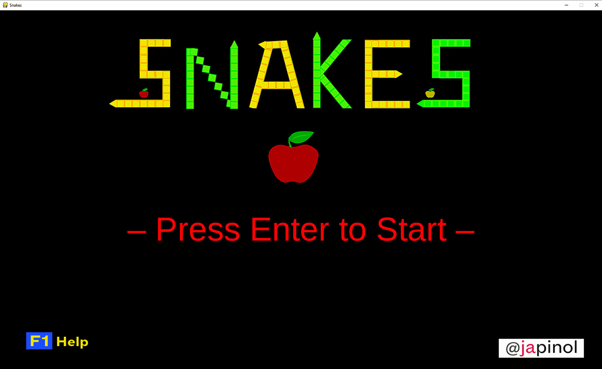
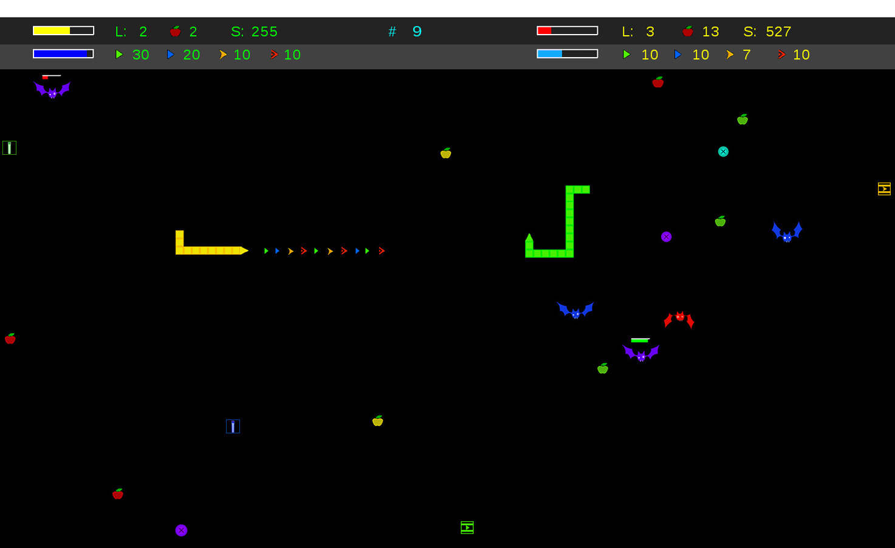
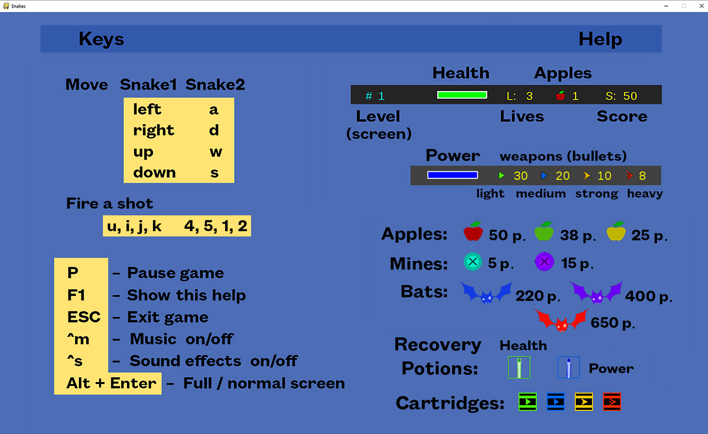

## Snakes

	Similar to classic Snake game but with player versus player version and other surprises.
	Objective: Each player will try to win the game by getting the best score.

	program: snakes
	version: 1.0.2
	language: English
	author: Joan A. Pinol
	author_nickname: japinol
	author_gitHub: japinol7
	author_twitter: @japinol
	main module: snakes_game.py
	requirements: pygame
	Python requires: 3.7 or greater.
	Python versions tested: 
            3.7.3  64bits under Windows 10
            3.9.12 64bits under Windows 10
            3.10.10 64bits under Windows 10

## Screenshots

  
  
  

## Rules and user guide

	> A snake can move to the following directions: left, right, up, down.
	  Although it cannot reverse the current direction directly, it can do it if the player
	  press a vertical key and an horizontal key simultaneously.
	> A snake has a head of one piece and starts with a body length of N pieces (by default 5, but it can be changed by the user). 
	> Each time a snake eats an apple, its body grows by one piece.
	> If the head of a snake collides with the body of another snake, the snake that collides gets damage.
	> If the head of a snake collides with the head of another snake, both snakes get damage.
	> A snake have health and lives. Each time that its health is depleted, it loses a life.
	  When a snake exhaust all their lives dies and cannot move anymore.
	  But the game continues until the other player dies, its snake body length reaches n pieces (700 by default) or he exits the game.
	> Levels: 
	    > Levels are completed by eating all the apples of the board.
	    > When a level is finished, all remaining mines, cartridges and recovery potions are removed from the board.
	    > Surviving bats remain on the board.
	> Apples: 
	    > There are three types of apples:
	        > Red apples: They give you 50 points. They are high quality apples.
    	    > Green apples: They give you 38 points. They are normal quality apples.
	        > Yellow apples: They give you 25 points. They are less than normal quality apples, but still tasty.
	> Mines: 
	    > There are two types of mines:
	        > Aqua mines: They deal medium damage.
	        	> If and only if you destroy them with a weapon, you get 5 points.
	        > Lilac mines: They deal great damage
	        	> If and only if you destroy them with a weapon, you get 15 points.
	> Bats: 
	    > They bite your head/neck (never the body) whenever you touch them with your head.
          But they receive damage too, and eventually they die.
          Unlike mines, they do not disappear when players reach a new level.
	    > There are three types of bats:
	        > Blue bats: They deal normal damage. They give you 220 points.
	        > Lilac bats: They deal medium damage. They give you 400 points.
	        > Red bats: They deal great damage. They give you 650 points.
	> Potions: 
	    > Recovery potion: health.
	    > Recovery potion: power.
	> Cartridges: 
	    > They contain bullets.
	> Weapons and bullets:
        > There are four kind of weapons that snakes can use:
            > A light weapon: Laser 1.
            > A medium weapon: Laser 2.
            > A strong weapon: Photonic.
            > A heavy weapon: Neutronic.
          A bullet can hit a/an:
            > Snake's head: Deal damage to the snake.
            > Snake's body: Do not deal damage to the snake, but the bullet is destroyed. 
            > Bat: The bat loses health and can die.
            > Apple: The apple is destroyed, but you do not get points.
            > Mine: The mine loses health and can be destroyed.
            > Potion, cartridge...: The item is destroyed, but you get nothing.
	> The winner of the game is the player who has the best score when the game ends.
	> The program maintain the scores of the players.
	> Currently, only two players are allowed and they have to control their snake on the same client game:
		> Player1 controls snake1 using the keyboard keys: left, right, up, down.
		> Player2 controls snake2 using the keyboard keys: a, d, w, s.
	> Information in the score line:
		> First line:
			> Green player score bar:
				> ====:  Health bar.
				> L: 	  Remaining lives.
				> apples: Apples eaten.
				> S: 	  Score.
			> #: Current level.
			> Yellow player score bar:
				> ====:  Health bar.
				> L: 	  Remaining lives.
				> apples: Apples eaten.
				> S: 	  Score.
		> Second line:
			> Green player score bar:
				> ====:  Power bar.
				> Remaining bullets for each of the four weapons.
			> Yellow player score bar:
				> ====:  Power bar.
				> Remaining bullets for each of the four weapons.

## Keyboard keys
			 F1:    Show a help screen while playing the game
			  left,     a:    move snake to the left
			  right,    d:    move snake to the right
			  up,       w:    move snake up
			  down,     s:    move snake down
			  u         4:    fire a light shot
			  i         5:    fire a medium shot
			  j         1:    fire a strong shot
			  k         2:    fire a heavy shot
			   p:    pause
			 ESC: exit game
			  ^m:    pause/resume music
			  ^s:    sound effects on/off
			  Alt + Enter: change full screen / normal screen mode
			  L_Ctrl + R_Alt + g: grid on/off
			
			  ^h:    shows this help to the console
			  ^d:    print debug information to the console
			  ^l:    write debug information to a log file

## Usage

	snakes [-h] [-b BODY_LENGTH] [-m MAX_BODY_LEN] [-r SCORE_TO_WIN] [-c CELL_SIZE] [-w SCREEN_WIDTH] [-e SCREEN_HEIGHT] [-p] [-f] [-s SPEED_PCT] [-t]
	
	optional arguments:
	  -h, --help            show this help message and exit
	  -b BODY_LENGTH,	--bodylen BODY_LENGTH
	                        body length of the snakes at the start of the game.
	  -m MAX_BODY_LEN,	--maxbodylen MAX_BODY_LEN
	                        when a snake reaches the max. body length, the game ends.
	  -r SCORE_TO_WIN, 	--scoretowin SCORE_TO_WIN
	                        when a snake reaches this score, the game ends and it wins.
	  -c CELL_SIZE, 	--cellsize CELL_SIZE
	                        size of each cell, i.e., the size of the serpent pieces.
	  -w SCREEN_WIDTH, 	--widthscreen SCREEN_WIDTH
	                        width of the screen.
	                        If screen height is not supplied, the best proportion is calculated. 
	  -e SCREEN_HEIGHT, 	--heightscreen SCREEN_HEIGHT
	                        height of the screen.
	                        If screen width is not supplied, the best proportion is calculated.
	  -p, 			--portrait
	                        set screen to portrait mode.
	  -f, 			--fullscreen
	                        Starts the game in full screen mode.
	  -s SPEED_PCT, 	--speedpct SPEED_PCT
	                        Changes the speed of the game by a percentage.
	                        For example: 200 would be twice the normal speed, 50 would be half the normal speed.
	  -t, 			--debugtraces
	                        show debug back traces information when something goes wrong.

**Default optional arguments**

		BODY_LENGTH		5
		MAX_BODY_LEN	700
		SCORE_TO_WIN	999999
		CELL_SIZE		14
		SCREEN_WIDTH	1260
		SCREEN_HEIGHT	903
		SPEED_PCT		100
		portrait		False
		fullscreen		False
		debugtraces		False

**Examples of usage**

	If snakes has not been installed as an app:
		$ python -m snakes
		$ python -m snakes --bodylen 10 --cellsize 18 --widthscreen 850  --scoretowin 450
		$ python -m snakes --bodylen 20 --cellsize 10 --widthscreen 1240
		$ python -m snakes --bodylen 8  --cellsize 12 --widthscreen 1920 --fullscreen
		$ python -m snakes --bodylen 1  --cellsize 12 --widthscreen 1080 --portrait
		$ python -m snakes --bodylen 14 --cellsize 8  --widthscreen 850  --heightscreen 520 --maxbodylen 35
		$ python -m snakes --bodylen 10 --cellsize 12 --widthscreen 520  --heightscreen 860
		$ python -m snakes --bodylen 9  --cellsize 24 --widthscreen 1280 --maxbodylen 50
		$ python -m snakes --bodylen 12 --cellsize 14 --widthscreen 800  --heightscreen 530 --speedpct 120
		$ python -m snakes --bodylen 12 --cellsize 8  --widthscreen 800  --speedpct 120

**To make Snakes work**

	Do this:
	    1. Clone this repository.
	    2. Go to its folder in your system.
	    3. $ python -m snakes

     If you need to install pygame library just do it this way. Try:
	    $ pip install pygame
